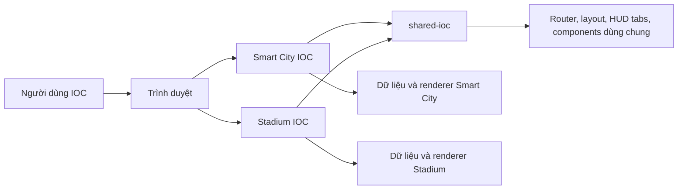
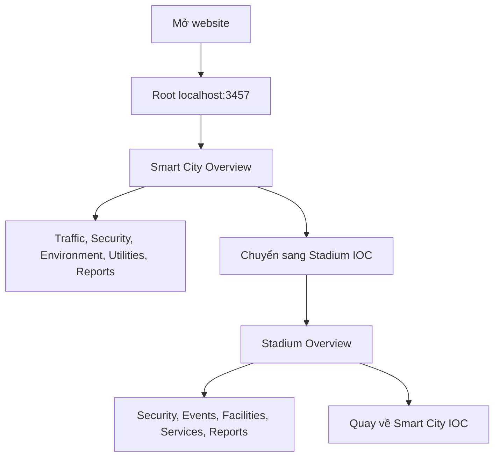

# IOC System BRD/SRS

Phiên bản: 1.0  
Ngày: 2026-06-08  
Dự án: Vinsmartcity IOC Prototype  
Đối tượng đọc: Ban lãnh đạo, chủ đầu tư, PM, BA, UI/UX, frontend team

## 1. Tóm Tắt Điều Hành

Hệ thống Vinsmartcity IOC Prototype mô phỏng trung tâm điều hành thông minh cho hai miền nghiệp vụ chính:

- Smart City IOC: điều hành tổng quan đô thị thông minh, giao thông, an ninh, môi trường, tiện ích và báo cáo.
- Stadium IOC: điều hành sân vận động và sự kiện, bao gồm tổng quan vận hành, an ninh, sự kiện, cơ sở vật chất, dịch vụ và báo cáo.

Mục tiêu của hệ thống là trình bày một trải nghiệm điều hành trực quan, có bản đồ/3D scene, dashboard HUD, biểu đồ, cảnh báo và các hành động nhanh. Bản hiện tại là frontend prototype chạy local, dùng dữ liệu mô phỏng trong repo, phù hợp để demo luồng nghiệp vụ, giao diện vận hành và kiến trúc tách module.

Giá trị chính:

- Giúp lãnh đạo nhìn nhanh trạng thái vận hành của đô thị và sân vận động.
- Giúp đội vận hành theo dõi chỉ số, cảnh báo, khu vực rủi ro và báo cáo.
- Làm nền tảng demo để mở rộng thành sản phẩm có kết nối dữ liệu thực.
- Tách Smart City, Stadium và phần dùng chung để giảm rủi ro sửa một phần làm hỏng phần khác.

## 2. Phạm Vi Hệ Thống

### 2.1 Trong Phạm Vi

- Website prototype cho Smart City IOC và Stadium IOC.
- Điều hướng nội bộ theo từng trang/chức năng.
- Layout trung tâm điều hành có sidebar trái/phải, khu vực bản đồ/3D ở giữa.
- Chart, HUD, KPI, cảnh báo, danh sách sự kiện và các module minh họa.
- Dữ liệu mô phỏng lưu trong các file JavaScript nội bộ.
- Kiến trúc frontend tách thành `smartcity-ioc`, `stadium-ioc` và `shared-ioc`.
- Dev server local để chạy demo.

### 2.2 Ngoài Phạm Vi Hiện Tại

- Đăng nhập, phân quyền người dùng.
- Backend API thật.
- Kết nối camera, IoT, GIS, VMS, BMS, ticketing hoặc hệ thống bên thứ ba.
- Cơ sở dữ liệu thật.
- Ghi log audit production.
- Triển khai cloud/on-prem production.
- SLA, HA, backup, DR và giám sát production.

## 3. Tổng Quan Kiến Trúc



### 3.1 Cấu Trúc Thư Mục Chính

| Khu vực | Vai trò |
| --- | --- |
| `smartcity-ioc/` | Ứng dụng Smart City IOC, gồm HTML entry, partial pages, CSS, data, scene, chart và renderer riêng. |
| `stadium-ioc/` | Ứng dụng Stadium IOC, gồm HTML entry, partial pages, CSS, data, scene, chart, renderer và model 3D sân vận động. |
| `shared-ioc/` | Thành phần dùng chung như bootstrap, router, layout, token, component CSS, HUD tabs, sidebar resize và block drag dùng chung. |
| `scripts/` | Dev server, smoke check, export Excel và các script tiện ích. |
| `tests/` | Kiểm thử Playwright cho Stadium visual. |

### 3.2 Nguyên Tắc Tách Logic

- Logic nghiệp vụ Smart City nằm trong `smartcity-ioc/assets/js`.
- Logic nghiệp vụ Stadium nằm trong `stadium-ioc/assets/js`.
- Thành phần dùng chung mới đặt trong `shared-ioc`.
- Smart City không import trực tiếp asset JS/CSS của Stadium.
- Stadium không import trực tiếp asset JS/CSS của Smart City.
- State UI dùng chung phải có namespace riêng để tránh ghi đè localStorage.

## 4. Business Requirements Document

### 4.1 Mục Tiêu Nghiệp Vụ

| Mã | Yêu cầu nghiệp vụ | Mô tả |
| --- | --- | --- |
| BR-01 | Giám sát tập trung | Cung cấp một màn hình tổng quan để quan sát tình trạng vận hành Smart City và Stadium. |
| BR-02 | Điều hướng theo miền nghiệp vụ | Cho phép chuyển nhanh giữa các phần tổng quan, an ninh, giao thông/sự kiện, môi trường/tiện ích/cơ sở vật chất, dịch vụ và báo cáo. |
| BR-03 | Trực quan hóa dữ liệu | Hiển thị KPI, biểu đồ, bản đồ, 3D scene và module cảnh báo để người dùng nắm tình hình nhanh. |
| BR-04 | Hỗ trợ ra quyết định | Cung cấp cảnh báo, trạng thái rủi ro và hành động nhanh để điều phối vận hành. |
| BR-05 | Demo sản phẩm | Phục vụ demo với lãnh đạo/khách hàng về trải nghiệm IOC hiện đại. |
| BR-06 | Giảm rủi ro bảo trì | Tách module để đội frontend có thể sửa Smart City hoặc Stadium mà không làm ảnh hưởng phần còn lại. |

### 4.2 Nhóm Người Dùng

| Nhóm | Nhu cầu chính |
| --- | --- |
| Lãnh đạo/ban quản lý | Xem tổng quan, chỉ số chính, rủi ro và năng lực giám sát của hệ thống. |
| Điều phối viên IOC | Theo dõi cảnh báo, camera/bản đồ/scene, tình trạng vận hành và hành động nhanh. |
| Đội an ninh | Theo dõi khu vực, cổng vào/ra, mật độ, cảnh báo và tình huống khẩn cấp. |
| Đội kỹ thuật | Theo dõi cơ sở vật chất, hệ thống hạ tầng, báo cáo và tình trạng module. |
| Đội phát triển | Bảo trì frontend, thêm module, tách logic và chuẩn bị kết nối backend trong tương lai. |

### 4.3 Quy Trình Nghiệp Vụ Chính

#### Smart City IOC

1. Người dùng mở Smart City IOC.
2. Hệ thống hiển thị tổng quan đô thị với KPI, bản đồ/scene và module vận hành.
3. Người dùng chuyển sang Giao thông, An ninh, Môi trường, Tiện ích hoặc Báo cáo.
4. Hệ thống cập nhật chart, scene, sidebar HUD và nội dung theo trang.
5. Người dùng đọc cảnh báo, xem chỉ số và đánh giá tình trạng vận hành.

#### Stadium IOC

1. Người dùng mở Stadium IOC.
2. Hệ thống hiển thị tổng quan sân vận động với scene 3D, chỉ số khách vào sân, cổng, khu vực và vận hành sự kiện.
3. Người dùng chuyển sang An ninh, Sự kiện, Cơ sở vật chất, Dịch vụ hoặc Báo cáo.
4. Hệ thống cập nhật HUD, chart, bản đồ/scene và các module hành động theo đúng miền nghiệp vụ.
5. Người dùng theo dõi rủi ro, xem báo cáo và thực hiện các thao tác demo như mở popup/hành động nhanh.

## 5. Functional Requirements

### 5.1 Yêu Cầu Chung

| Mã | Yêu cầu | Ưu tiên | Trạng thái |
| --- | --- | --- | --- |
| FR-01 | Hệ thống có trang Smart City IOC riêng. | Cao | Đã có |
| FR-02 | Hệ thống có trang Stadium IOC riêng. | Cao | Đã có |
| FR-03 | Mỗi app có header/shell và partial pages riêng. | Cao | Đã có |
| FR-04 | Có router nội bộ để chuyển tab/page không cần reload toàn bộ app. | Cao | Đã có |
| FR-05 | Có thành phần dùng chung trong `shared-ioc`. | Cao | Đã có |
| FR-06 | Smart City và Stadium không import trực tiếp asset JS/CSS của nhau. | Cao | Đã có |
| FR-07 | Layout command có sidebar trái, vùng trung tâm và sidebar phải. | Cao | Đã có |
| FR-08 | Sidebar có thể resize và HUD block có thể kéo thả với state riêng. | Trung bình | Đã có |

### 5.2 Smart City IOC

| Mã | Yêu cầu | Trạng thái |
| --- | --- | --- |
| SC-FR-01 | Hiển thị trang Tổng quan Smart City. | Đã có |
| SC-FR-02 | Hiển thị module Giao thông. | Đã có |
| SC-FR-03 | Hiển thị module An ninh. | Đã có |
| SC-FR-04 | Hiển thị module Môi trường. | Đã có |
| SC-FR-05 | Hiển thị module Tiện ích. | Đã có |
| SC-FR-06 | Hiển thị module Báo cáo. | Đã có |
| SC-FR-07 | Hiển thị chart và panel theo từng trang. | Đã có |
| SC-FR-08 | Hiển thị scene/bản đồ minh họa theo miền nghiệp vụ. | Đã có |

### 5.3 Stadium IOC

| Mã | Yêu cầu | Trạng thái |
| --- | --- | --- |
| ST-FR-01 | Hiển thị trang Tổng quan Stadium. | Đã có |
| ST-FR-02 | Hiển thị trang An ninh Stadium. | Đã có |
| ST-FR-03 | Hiển thị trang Sự kiện. | Đã có |
| ST-FR-04 | Hiển thị trang Cơ sở vật chất. | Đã có |
| ST-FR-05 | Hiển thị trang Dịch vụ. | Đã có |
| ST-FR-06 | Hiển thị trang Báo cáo. | Đã có |
| ST-FR-07 | Hiển thị 3D model sân vận động. | Đã có |
| ST-FR-08 | Hỗ trợ popup/modal và hành động nhanh trong các module vận hành. | Một phần |

## 6. Non-Functional Requirements

| Mã | Nhóm | Yêu cầu |
| --- | --- | --- |
| NFR-01 | Maintainability | Code phải tách theo miền nghiệp vụ, phần dùng chung đặt trong `shared-ioc`. |
| NFR-02 | Modularity | Thêm/sửa module Smart City không được làm hỏng Stadium và ngược lại. |
| NFR-03 | Performance | Trang demo cần load được trên dev server local, các scene/3D không được làm treo UI. |
| NFR-04 | Usability | Giao diện phải ưu tiên nhìn nhanh, dùng biểu đồ/sơ đồ/bản đồ thay vì quá nhiều text. |
| NFR-05 | Responsiveness | Layout cần thích ứng với kích thước viewport và sidebar resize. |
| NFR-06 | Testability | Có lệnh kiểm tra dev server và test Playwright cho các luồng quan trọng. |
| NFR-07 | Portability | Chạy local bằng Node.js và npm, không phụ thuộc backend. |
| NFR-08 | Safety | Không commit artifact sinh ra từ test/export nếu không cần thiết. |

## 7. Software Requirements Specification

### 7.1 Môi Trường Chạy

- Node.js 20 LTS trở lên.
- npm 10 trở lên.
- Dev server mặc định: `http://localhost:3457`.
- Smart City IOC: `http://localhost:3457/smartcity-ioc/smartcity-index.html`.
- Stadium IOC: `http://localhost:3457/stadium-ioc/stadium-index.html`.

Lệnh chạy:

```powershell
npm.cmd run dev
```

Lệnh kiểm tra nhanh:

```powershell
npm.cmd run dev:check
```

### 7.2 Frontend Entry Points

| App | Entry HTML | Entry JS |
| --- | --- | --- |
| Smart City IOC | `smartcity-ioc/smartcity-index.html` | `smartcity-ioc/assets/js/smartcity-app.js` |
| Stadium IOC | `stadium-ioc/stadium-index.html` | `stadium-ioc/assets/js/stadium-app.js` |

### 7.3 Shared Modules

| Module | Vai trò |
| --- | --- |
| `shared-ioc/assets/js/bootstrap.js` | Load shell, load partial pages, hydrate pages và bind router. |
| `shared-ioc/assets/js/router.js` | Điều hướng nội bộ theo `data-nav`. |
| `shared-ioc/assets/js/render/hud-tabs.js` | Điều khiển tab trong HUD. |
| `shared-ioc/assets/js/render/sidebar-resize.js` | Resize sidebar dùng chung, có namespace state. |
| `shared-ioc/assets/js/render/hud-block-drag.js` | Kéo thả HUD block dùng chung, có namespace state. |
| `shared-ioc/assets/css/*` | Token, layout và component CSS dùng chung. |

### 7.4 Data Layer

Hiện tại dữ liệu là mock/static data trong repo:

- Smart City data: `smartcity-ioc/assets/js/data/`.
- Stadium data: `stadium-ioc/assets/js/data/`.
- Chart registry và scene registry điều phối việc khởi tạo chart/scene theo trang.

Trong giai đoạn production, các file data mock có thể được thay bằng API client layer, nhưng cần giữ hợp đồng dữ liệu ổn định để renderer không phải sửa lớn.

### 7.5 UI Rendering Layer

- Smart City renderer nằm trong `smartcity-ioc/assets/js/render/`.
- Stadium renderer nằm trong `stadium-ioc/assets/js/render/`.
- Renderer không nên gọi trực tiếp sang app khác.
- Nếu có component dùng chung, cần đưa lên `shared-ioc/assets/js/render/`.

### 7.6 Scene Và Chart Layer

| Layer | Smart City | Stadium |
| --- | --- | --- |
| Chart | `smartcity-ioc/assets/js/charts/` | `stadium-ioc/assets/js/charts/` |
| Scene | `smartcity-ioc/assets/js/scene/` | `stadium-ioc/assets/js/scene/` |
| 3D model | Không có model riêng trong scope hiện tại | `stadium-ioc/assets/models/` |

### 7.7 State Management

Hiện tại state chủ yếu nằm trong DOM, module scope và localStorage cho một số tính năng UI.

Quy tắc:

- State của Stadium phải dùng key riêng của Stadium.
- State của Smart City phải dùng key riêng của Smart City.
- Shared helper phải nhận `storageNamespace` khi cần lưu localStorage.
- Không dùng một localStorage key chung cho hai app nếu state có thể khác nhau.

## 8. Luồng Điều Hướng Hệ Thống



## 9. Quản Lý Rủi Ro

| Rủi ro | Tác động | Biện pháp |
| --- | --- | --- |
| Sửa CSS chung làm ảnh hưởng cả hai app | Cao | Chỉ sửa `shared-ioc` khi thật sự là component chung, test cả Smart City và Stadium sau khi sửa. |
| Renderer gọi trực tiếp sang app khác | Cao | Cấm import trực tiếp asset JS/CSS giữa `smartcity-ioc` và `stadium-ioc`. |
| localStorage key dùng chung | Trung bình | Dùng namespace theo app. |
| Trang 3D nặng gây timeout screenshot | Trung bình | Kiểm tra DOM/computed style khi screenshot quá nặng. |
| Mock data khác API thật | Trung bình | Định nghĩa hợp đồng dữ liệu trước khi kết nối backend. |
| File shared chưa được đặt tên theo domain trung lập | Thấp/Trung bình | Refactor dần các selector có tên app cũ nếu tiếp tục mở rộng. |

## 10. Tiêu Chí Chấp Nhận

| Mã | Tiêu chí |
| --- | --- |
| AC-01 | `npm.cmd run dev:check` trả về HTTP 200 cho root, Smart City và Stadium. |
| AC-02 | Smart City load được trang Overview, có sidebar trái/phải và nội dung trung tâm. |
| AC-03 | Stadium load được trang Overview, có sidebar trái/phải và 3D/scene trung tâm. |
| AC-04 | Smart City không import trực tiếp asset JS/CSS từ `stadium-ioc`. |
| AC-05 | Stadium không import trực tiếp asset JS/CSS từ `smartcity-ioc`. |
| AC-06 | Khi sửa file app-specific của Smart City, Stadium không bị thay đổi nếu không sửa `shared-ioc`. |
| AC-07 | Khi sửa file app-specific của Stadium, Smart City không bị thay đổi nếu không sửa `shared-ioc`. |
| AC-08 | Các shared helper có namespace state riêng khi dùng localStorage. |

## 11. Roadmap Đề Xuất

### Giai Đoạn 1: Ổn Định Prototype

- Hoàn thiện tách logic và CSS shared/app-specific.
- Bổ sung smoke test cho cả Smart City và Stadium.
- Ghi rõ convention import trong README hoặc file architecture.
- Chuẩn hóa tên selector trong shared CSS để bớt phụ thuộc tên Smart City/Stadium cũ.

### Giai Đoạn 2: Kết Nối Dữ Liệu

- Định nghĩa API contract cho KPI, chart, alert, scene marker và report.
- Thêm adapter layer thay cho mock data.
- Thêm loading, empty state và error state.
- Thêm config môi trường dev/staging/demo.

### Giai Đoạn 3: Sẵn Sàng Demo Chuyên Nghiệp

- Thêm tài liệu user flow và demo script.
- Thêm test Playwright cho Smart City.
- Thêm checklist QA theo từng màn hình.
- Đóng gói bản demo cho trình bày lãnh đạo.

### Giai Đoạn 4: Hướng Production

- Đăng nhập và phân quyền.
- Backend API và database.
- Audit log và monitoring.
- Tích hợp camera/IoT/GIS/hệ thống sự kiện nếu có.
- Kiến trúc deploy và bảo mật.

## 12. Ghi Chú Cho Đội Phát Triển

- Khi thêm tính năng riêng của Smart City, ưu tiên đặt trong `smartcity-ioc`.
- Khi thêm tính năng riêng của Stadium, ưu tiên đặt trong `stadium-ioc`.
- Chỉ đưa code lên `shared-ioc` nếu cả hai app dùng chung thật sự.
- Sau khi sửa `shared-ioc`, phải kiểm tra cả hai URL Smart City và Stadium.
- Sau khi sửa Stadium UI nặng, nên verify bằng browser/DOM thay vì chỉ đọc code.
- Trên Windows PowerShell, nếu `npm` bị chặn bởi execution policy, dùng `npm.cmd`.

## 13. Phụ Lục: Lệnh Thường Dùng

```powershell
npm.cmd ci
npm.cmd run dev
npm.cmd run dev:check
npm.cmd run test:stadium
```

Nếu port 3457 đã bị dùng:

```powershell
$env:PORT=3458; npm.cmd run dev
```
